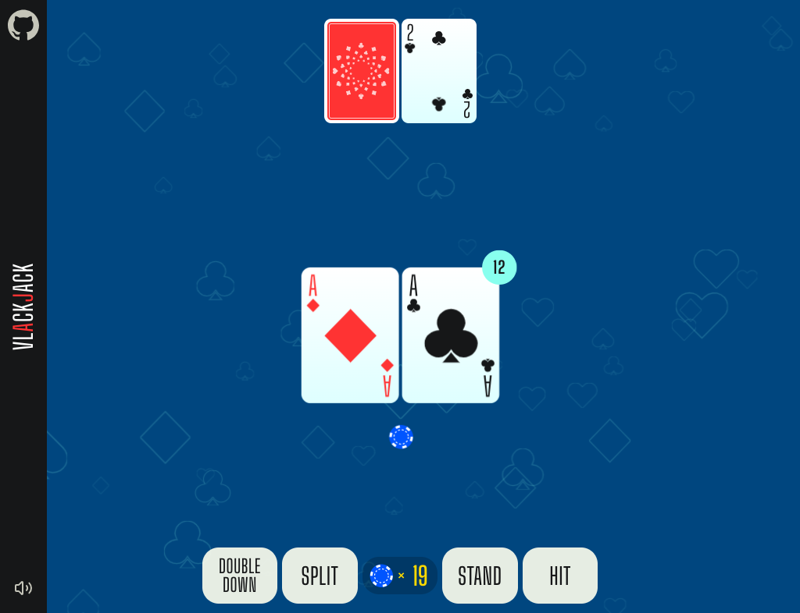

# Blackjack (with AI!) — Red Hat Developer Advocates ♠️♥️♣️♦️

> [!NOTE]
> As of January 2025, Vlackjack is now written in Vue 3! 🥳 If you would still like to view the source code for the Vue 2 / vuex
> version, see the [vue2 branch](https://github.com/kevinleedrum/vlackjack/tree/vue2).

## Play Now 🚀

https://kevinleedrum.github.io/vlackjack/

## Introduction

This fork adds an "Ask AI" button powered by Llama Stack, supporting local Ollama in dev and vLLM in production, plus an `/admin` page for latency and TTFT metrics.

Vlackjack is a single-player HTML5 blackjack game built with [Vue 3](https://vuejs.org/).



All of the sounds in this game are from [Freesound](https://freesound.org) and have a CC0 license.

## NPM Scripts

```bash
# install dependencies
npm install

# serve for development
npm run dev

# build
npm run build
```

## Llama Stack Integration

Environment variables (Vite):

```
VITE_LS_BASE_URL=http://localhost:8080/v1
VITE_LS_API_KEY=
VITE_LS_OLLAMA_MODEL_ID=llama3.2
VITE_LS_VLLM_MODEL_ID=mistral-small-24b-w8a8
VITE_AI_PROVIDER=ollama
VITE_LS_NTFY_AGENT_ID=blackjack-ai-balance-notifications
```

References:
- Llama Stack inference and streaming: [meta-llama/llama-stack](https://github.com/meta-llama/llama-stack)
- TypeScript client SDK: [llama-stack-client-typescript](https://github.com/llamastack/llama-stack-client-typescript)

## Rules

- To keep the game simple, the initial bet is always one coin
- 6 Decks, shuffled after 75% have been played
- Blackjack pays 2-to-1
- Dealer stands on any 17 (`S17`)
- Double down on any two cards (`D2`)
- Double down after splitting (`DAS`) (except Aces)
- No resplitting (`NR`)
- No insurance (`NI`)

## License

[MIT](http://opensource.org/licenses/MIT)

Copyright (c) 2017-Present, Kevin Lee Drum
